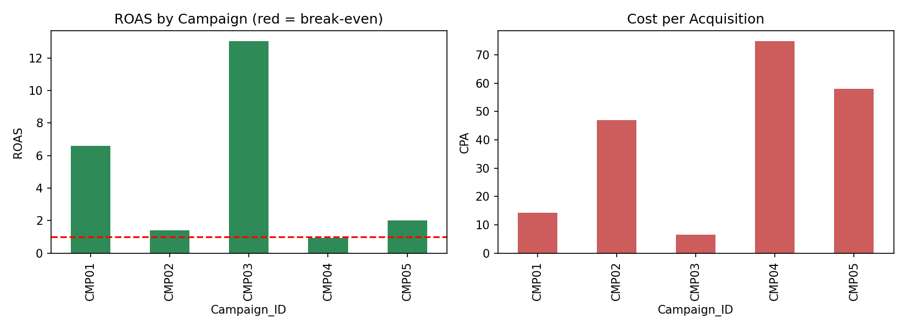
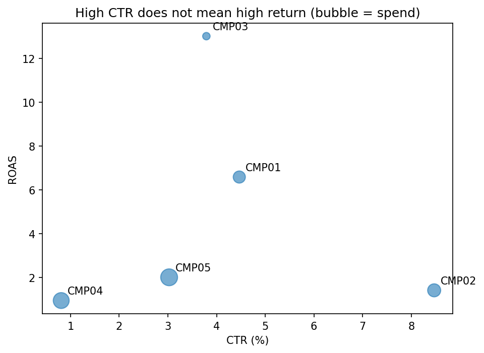
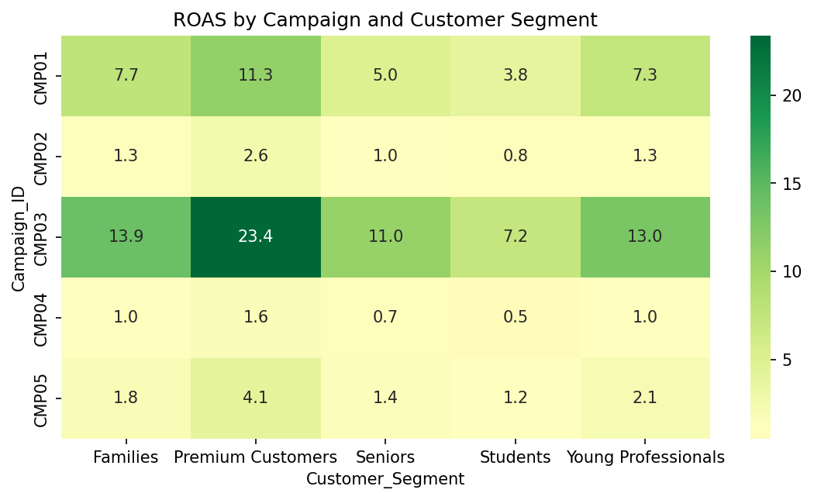
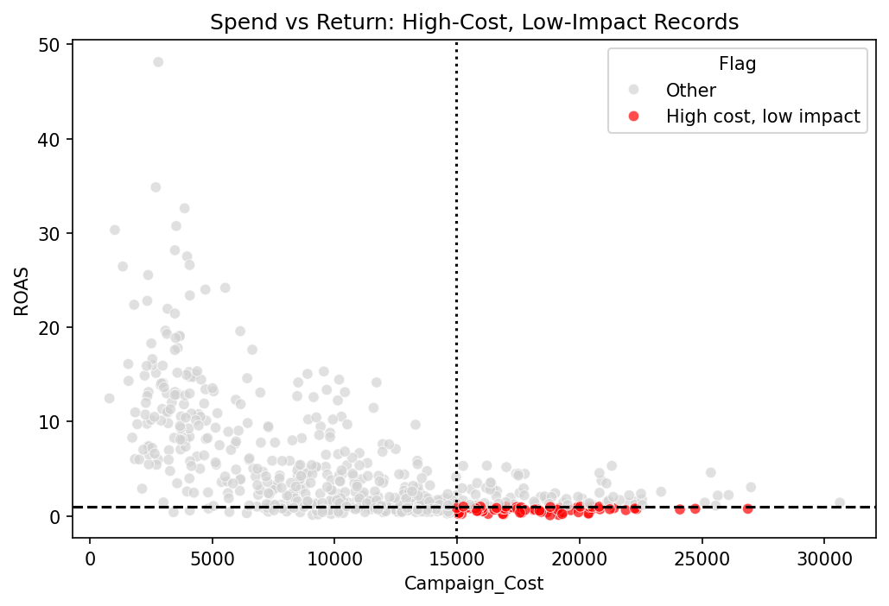
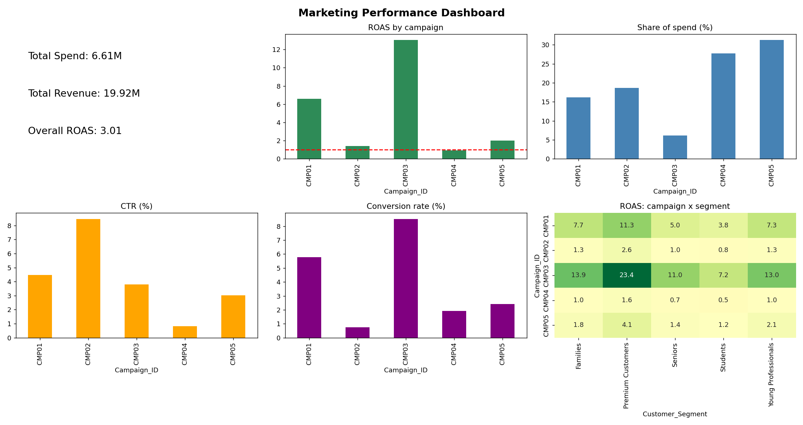
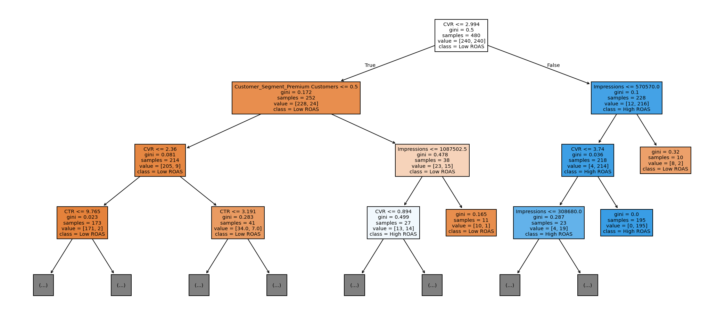

# Digital Marketing: Which Campaign Works?

Analysis of five digital marketing campaigns across five customer segments, focused on business metrics (CTR, conversion rate, CPA, ROAS) and budget decisions.

## Dataset
Simulated dataset of 608 records (7 columns): Campaign_ID, Customer_Segment, Campaign_Cost, Impressions, Clicks, Conversions, Revenue.
Cleaning: removed 8 duplicates, standardised segment labels, fixed 2 negative costs, corrected invalid click/conversion counts, filled missing values with campaign medians, and treated revenue outliers. Final dataset: 600 clean records.

## Metrics
- CTR = Clicks / Impressions
- Conversion rate = Conversions / Clicks
- CPA = Cost / Conversions
- ROAS = Revenue / Cost

## Key Insights
1. Email (CMP03) is the most efficient campaign: ROAS 13.03 on about 6% of total spend, yet about 26% of revenue.
2. Display (CMP04) loses money: ROAS 0.94 and a net loss of about 0.10M. It takes about 28% of spend for about 9% of revenue.
3. High CTR does not mean high revenue: Social (CMP02) has the highest CTR (8.47%) but only 0.74% conversion and ROAS 1.41. Email has a lower CTR (3.79%) and the best ROAS. The correlation between CTR and revenue is about 0.01.
4. Conversion rate is the main driver of return, accounting for about 86% of the Decision Tree's feature importance.
5. Premium Customers give the best return (ROAS 4.94) and Students the worst (1.75). Premium is the best segment in every campaign.
6. High cost, low impact: of the 150 highest-spend records, 72 have ROAS below 1. They come from Display (44), Influencer (23) and Social (5).
7. The Decision Tree predicts high vs low ROAS with about 95% test accuracy (ROC-AUC about 0.98, 5-fold CV about 0.92).

## Visualisations

## Marketing Performance Dashboard

## Model
Decision Tree Classifier (max depth 4, min 10 samples per leaf). Target: High_ROAS (ROAS at or above the median). Revenue and ROAS were excluded from the features to avoid leakage.
Results: models/metrics.txt

## Budget Recommendation
- Increase Email (CMP03) and Search (CMP01) in stages (for example +15 to 20%) and check that ROAS holds as spend grows.
- Cut or pause most Display (CMP04) spend, since it is below break-even.
- Fix Social (CMP02) before funding it further: it attracts clicks but does not convert, so review landing pages and offers.
- Restrict Influencer (CMP05) to Premium Customers, where its return is strongest.
- Judge budgets by ROAS, CPA and profit, not CTR.

## Files
- data/: raw, cleaned and summary datasets
- images/: charts and dashboard
- models/: trained Decision Tree and evaluation metrics
- Marketing_Campaign_Analysis.ipynb: full analysis notebook
